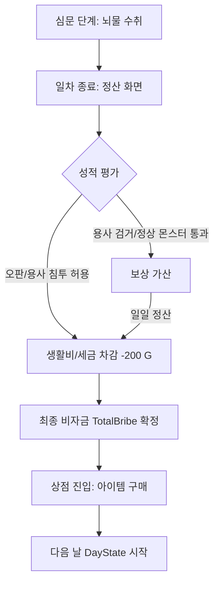

# 💰 상점 및 경제 시스템 규격 (Shop & Economy System) (v1.0)

본 문서는 프로젝트 `[용사님, 들켰죠?]`의 재화 획득, 정산 및 상점 이용 로직을 정의합니다. 플레이어는 심문 과정에서 획득한 비자금을 하루가 끝나는 시점에 상점에서 소모하여 다음 날의 생존율을 높입니다.

---

## 🔄 1. 경제 순환 구조 (Economy Loop)

### 1.1. 재화 획득 및 정산 흐름

| 명칭 | 변수명 (C# Key) | 타입 | 상세 설명 |
| :--- | :--- | :--- | :--- |
| **정판 보상 (정답)** | `CorrectReward` | `int` | 용사 검거 또는 정상 몬스터 통과 성공 시 지급 (+100 G) |
| **오판 보상 (오답)** | `WrongReward` | `int` | 판정 실패 시 지급되는 보상 없음 (0 G) |
| **비자금 수취 (뇌물)** | `BribeAmount` | `int` | 밀수꾼이나 일반 NPC에게 뇌물을 받을 시 추가 획득 (+400 G) |
| **일일 생활비 (세금)** | `DailyTax` | `int` | 매일 퇴근 시 고정적으로 차감되는 비용 (-200 G) |
| **보안 사고 벌금** | `SecurityPenalty` | `int` | 감사관에게 뇌물을 받거나 치명적 행위 적발 시 차감 (-1,000 G) |

---

## 🛒 2. 상점 이용 규격 (Shop Specification)

### 2.1. 이용 시점 (Timing)
- **제한**: 일차(Day) 진행 중에는 상점 접근 불가.
- **활성화**: 모든 NPC 판정이 종료되고 **"일차 정산 UI"**가 닫힌 직후 상점 씬(또는 팝업) 활성화.

### 2.2. 판매 아이템 리스트 (Standard Interface)
*실제 데이터 수치는 `Master_DataSheet.xlsx` [Item] 시트와 연동됩니다.*

| 아이템 ID | 아이템 명칭 | 예상 가격 (Price) | 기능 요약 |
| :--- | :--- | :--- | :--- |
| `ITEM_CIG` | **최고급 담배** | 250 G | 사용 시 대상 NPC의 스트레스(`Stress`)를 즉시 40 증가시킴 |
| `ITEM_DRK` | **에너지드링크**| 100 G | 익일 검문 인원수를 2명 추가로 늘려줌 (기본 5명 → 7명) |
| `ITEM_HYP` | **불법 최면 어플** | 450 G | 단 1회, NPC가 자신의 진짜 정체를 진실하게 답하게 함 |

---

## 📊 3. 기술 연동 가이드 (Developer Note)

### 3.1. 데이터 맵핑
- **아이템 데이터**: `ItemScriptableObject`를 통해 관리하며, 엑셀의 `item_price`, `item_effect_value` 컬럼과 매칭됩니다.
- **구매 로직**: `TotalBribe >= Price` 일 때 구매 버튼 활성화 및 `TotalBribe -= Price` 연산 후 세이브 파일 갱신.

### 3.2. 상태 전이 (State Transition)
- `GameState.Settlement` → `GameState.Store` → `GameState.ReadyToNextDay`순으로 전이됩니다.

---

## 📜 Revision History
| 날짜 | 버전 | 내용 | 작성자 |
| :--- | :--- | :--- | :--- |
| 2026-03-26 | v1.1 | **아이템 리스트 압축 및 스토리텔링 보강** - 심문 연장권 추가 및 불필요한 예시 아이템 제거 | Antigravity |
| 2026-03-26 | v1.0 | 초기 상점 진입 시점 및 경제 루프 규격 수립 | Antigravity |

---
*최종 업데이트: 2026-03-26*
*관리: Antigravity (AI Co-PM)*
