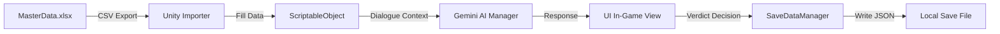

# 기술 구현 마스터 스펙 (Technical Master Spec) (v1.1)

본 문서는 프로젝트 `[용사님, 들겼죠?]`의 Unity 개발(강다영) 및 API 연동을 위한 **단일 기술 규격서**입니다. 변수 명명법, JSON 구조, 그리고 핵심 상수들을 일원화하여 관리합니다.

---

## 🏗️ 1. 표준 변수 명명 및 상수 (Standard Variable Naming)
*모든 코드, JSON, 기획 문서에서 공용으로 사용되는 명칭입니다.*

| 변수명 (C# Key) | 데이터 타입 | 초기값 | 기획서/데이터 시트 연동 명칭 |
| :--- | :--- | :--- | :--- |
| **`DayState`** | `int` | 1 | 현재 게임 진행 일차 (Day 1~7) |
| **`TotalBribe`** | `int` | 0 | 누적된 뇌물 총액 (비자금) |
| **`TrustPoint`** | `float` | 100.0 | 인사 고과 점수 (0~100) |
| **`Intelligence`** | `int` | Variable | NPC의 논리력 수치 (XLSX: `intel_val`) |
| **`QuestionLimit`** | `int` | **5** | NPC당 최대 질문 가능 횟수 |
| **`OfferAmount`** | `int` | **8,000** | 뇌물 표준 제시액 |
| **`IsHeroDetected`** | `bool` | `false` | 용사 정체 발각 판정 성공 여부 |
| **`NPCTier`** | String | A, B, C | NPC의 난이도 그룹 (A=Easy, B=Normal, C=Hard) |

---

## 📜 2. NPC 데이터 구조 시료 (JSON Sample Data)
*`NPCTier` 식별자가 추가되어 확률적 스폰 시스템에 대응합니다.*

```json
{
  "npcID": "NPC_01",
  "npcTier": "A",
  "name": "그로그락 (Groglak)",
  "species": "Orc",
  "intelligence": 30,
  "stressThreshold": 40,
  "defaultTone": "Casual",
  "entryPurpose": "무기 정기 소독 및 수리",
  "bribeProbability": 0.05,
  "standardBribe": 8000
}
```

---

## 🚀 3. 핵심 로직 구현 계획 (Implementation Logic)

### 3.1. 확률 기반 가중치 스폰 (Weighted Random Spawn)
- **알고리즘**: 일차(`DayState`) 값에 따라 `일차별_레벨_디자인_마스터`의 확률 테이블을 조회합니다.
- **로직**: `Random.Range(0, 100.0f)`를 통해 현재 일차의 Tier 가중치에 맞는 캐릭터를 NPC Pool에서 무작위로 추출하여 인스턴스화합니다.

### 3.2. 질문 횟수 및 판정 흐름
1. 유저의 Input(질문) 발생 시 `QuestionCount` 1씩 증가.
2. `QuestionCount == 5` 도달 시 시스템적으로 질문 입력창 비활성화 및 '최종 판정' 유도 VFX 출력.
3. '진실의 elixir' 사용 시 `QuestionCount`를 0으로 리셋하고, 내부 `Stress` 수치에 +50 가산.

### 3.3. 실시간 응답 파싱 및 VFX 트리거
- Gemini API의 응답 내 `isSurprised` 또는 `hesitation` 키값 존재 시, 캐릭터 유니티 스프라이트를 즉시 `Flustered` 표정으로 교체.
- 로컬 `Intelligence` 수치와 유저 질문의 키워드 매칭(Slip words)을 통한 의심도 가증 로직 구현.

## 🚀 4. AI 통신 및 대화 문맥 상세 사양 (AI & Context Specs)
*프로젝트의 핵심 기술인 AI 연동 및 데이터 보안에 관한 상세 내용은 아래 별도 문서를 참조합니다.*

1. **API 통신 및 보안 연동 가이드**
   - 내용: API 키 보안 관리(Proxy Server) 및 대화 문맥 유지(Stateless 대응) 전략.
   - [문서 바로가기](file:///c:/Users/dlska/Desktop/Hero_Exposed/Document_Hero_Exposed/01.MD_Origin/04_%EA%B8%B0%EC%88%A0_%EB%B0%8F_%EA%B5%AC%ED%98%84_%EC%82%AC%EC%96%91/API_%ED%86%B5%EC%8B%A0_%EB%B0%8F_%EB%B3%B4%EC%95%88_%EC%97%B0%EB%8F%99_%EA%B0%80%EC%9D%B4%EB%93%9C.md)

2. **AI 대화 세션 및 컨텍스트 규격**
   - 내용: AI의 기억력(Max Turns), 초기화 조건(Reset Trigger) 등 상세 제어 변수 규격.
   - [문서 바로가기](file:///c:/Users/dlska/Desktop/Hero_Exposed/Document_Hero_Exposed/01.MD_Origin/04_%EA%B8%B0%EC%88%A0_%EB%B0%8F_%EA%B5%AC%ED%98%84_%EC%82%AC%EC%96%91/AI_%EB%8C%80%ED%99%94_%EC%84%B8%EC%85%98_%EB%B0%8F_%EC%BB%A8%ED%85%8D%EC%8A%A4%ED%8A%B8_%EA%B7%9C%EA%B2%A9.md)

## 📐 5. 데이터 아키텍처 흐름 (Data Architecture Flow)
*기획 데이터가 게임 내 시스템과 AI, 세이브 데이터로 이어지는 기술적 흐름도입니다.*



---

## 📜 Revision History
| 날짜 | 버전 | 내용 | 작성자 |
| :--- | :--- | :--- | :--- |
| 2026-03-26 | v1.6 | **기술 구현 상세 간소화**<br>- 데이터 컨테이너 및 매니저 클래스 스니펫 제거, 데이터 흐름도만 유지 | Antigravity |
| 2026-03-26 | v1.5 | 협업 구조 최적화: 코드 관리 책임 분리 | Antigravity |
| 2026-03-25 | v1.3 | 문서 관리 규칙에 따른 이력 양식 표준화 | Antigravity |
| 2026-03-25 | v1.2 | AI 통신 및 대화 문맥 상세 사양 문서 링크 추가 | 이남기 |
| 2026-03-23 | v1.1 | 로그라이크 확률 로직 및 NPCTier 추가 (가중치 스폰 명문화) | 이남기 |
| 2026-03-23 | v1.0 | 기술 규격 전면 통합 및 변수명 표준화 | 이남기 |

---
*최종 업데이트: 2026-03-25*
*관리: Antigravity (AI Co-PM)*
