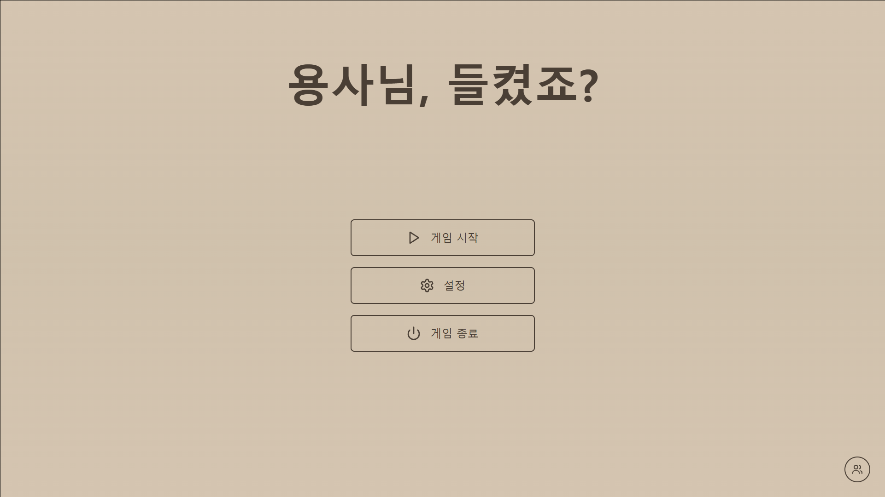
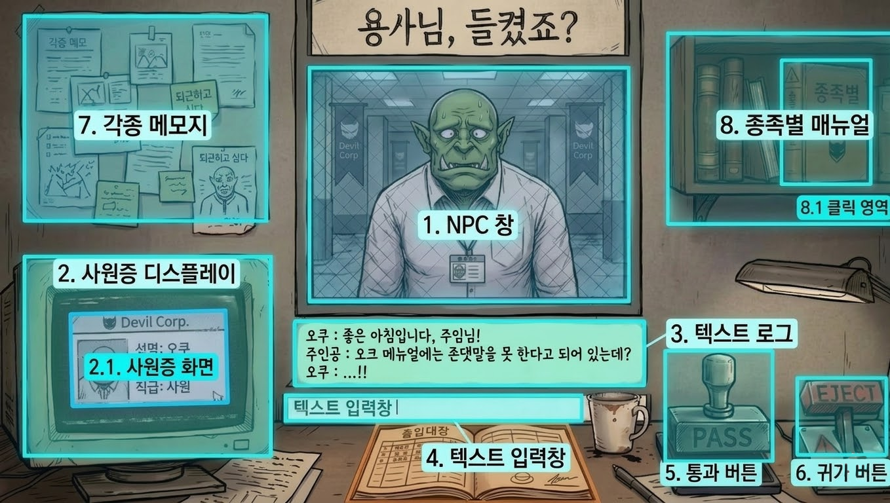
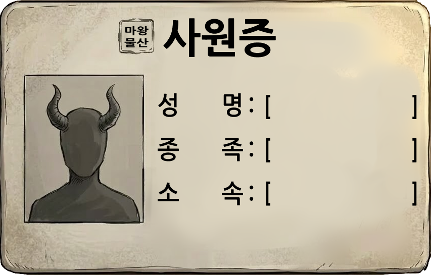
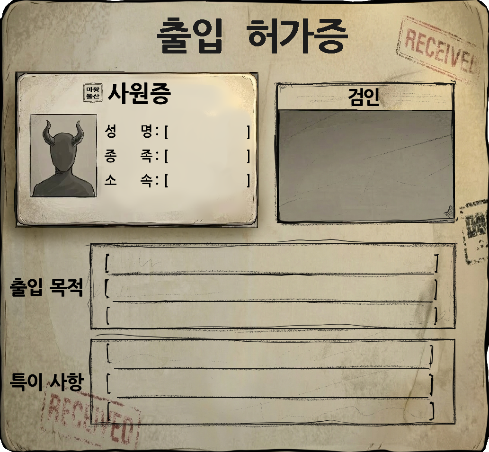
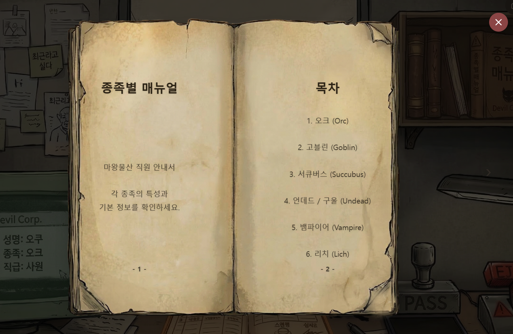
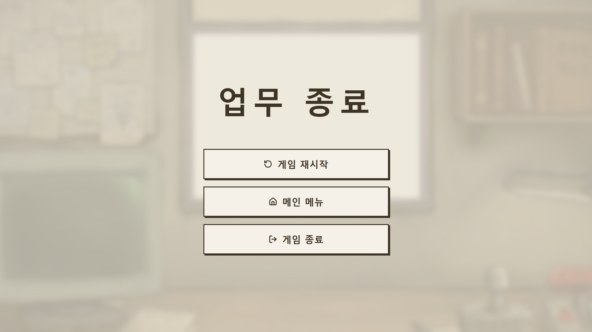
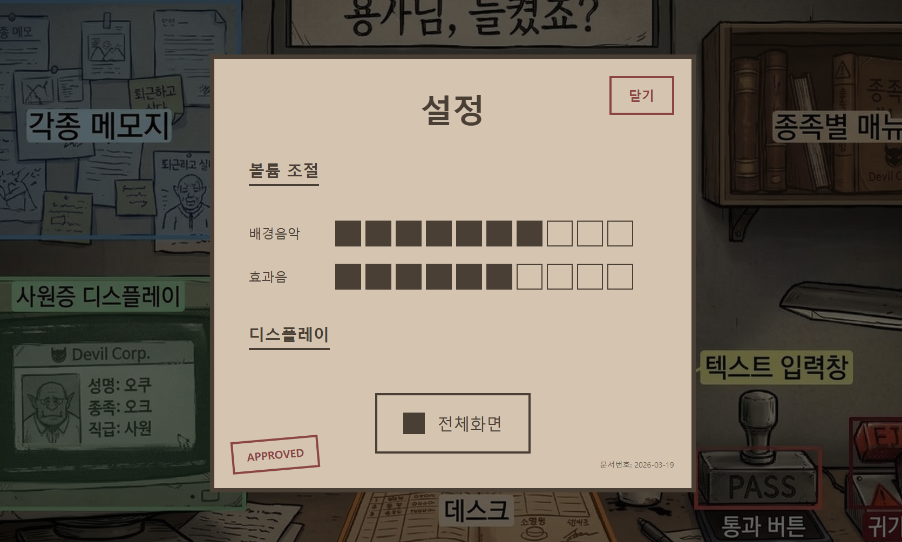

# [통합 UI/UX 기획서]

## 1. 문서 개요
| 항목 | 내용 |
| :--- | :--- |
| **프로젝트 명** | 용사님, 들켰죠? (Hero Exposed) |
| **문서 목적** | 마왕물산 1층 보안 데스크 UI/UX 레이아웃, 기능 정의 및 데이터 연동 로직 명세. |
| **톤앤매너** | 탁한 로우파이(Lo-Fi) 아날로그 톤 (베이지, 브라운관 초록, 낡은 붉은색) - K-블랙기업의 만성피로 테마. |
| **최종 수정일** | 2026-03-24 (v1.2) |

---

## 2. 기획서 버전 관리
| 버전 | 업로드 일자 | 업데이트 내역 |
| :--- | :--- | :--- |
| 1.0 | 2026.03.18 | 출입 허가증, 사원증 상세 시스템, 키워드 조합 심문 로직 추가 |
| 1.1 | 2026.03.19 | 게임 스타트 씬, 엔딩 씬, 공통 UI 항목 추가 |
| 1.2 | 2026.03.24 | UI 표 업데이트 및 양식 통합, 메인 씬 이미지 상세 수정 |

---

## 3. 글로벌 UI 규칙 (Global UI Rules)
게임 전반에 공통으로 적용되는 디자인 및 상호작용 규격.

| 항목 | 규격 및 내용 | 비고 |
| :--- | :--- | :--- |
| **해상도 (Resolution)** | 1920 × 1080 (16:9) 기준 | 캔버스 Scale Mode: Expand |
| **기본 폰트 (Font)** | 나눔고딕 ExtraBold (40px 기준) | 시스템 UI 텍스트용 |
| **특수 폰트 (Special Font)** | 수필(Handwriting) 또는 타자기 폰트 | 메모지, 서류 등 아날로그 에셋 |
| **상호작용 (Hover)** | 마우스 hover 시 Scale 1.1배 확대 및 외곽선 강조 | 모든 상호작용 가능한 오브젝트 |

---

## 4. 게임 씬별 UI 기능 및 배치 수치화
각 씬(Scene)별로 출력되는 오브젝트의 절대 좌표 및 크기, 기능 설정.
> **Note**: 위치(Pos X, Y) 값은 상위 UI와 개별 앵커/Pivot을 기준으로 한 로컬 좌표(Local Position) 절대 픽셀값입니다.

### 4.1. [Start Scene] - 게임 시작 화면

| No. | UI 요소명 | UI 타입 | 상위 UI | W | H | Pos X | Pos Y | 앵커/Pivot | 기능 및 디자인 상세 |
| :--- | :--- | :--- | :--- | :--- | :--- | :--- | :--- | :--- | :--- |
| 1 | BG_Base | Image | Canvas | 1920 | 1080 | 0 | 0 | 0.5, 0.5 | 배경 이미지 |
| 2 | Txt_Logo | Image | Canvas | 900 | 200 | 0 | -180 | 0.5, 1 | "용사님, 들켰죠?" 로고 |
| 3 | Menu_Group | Image | Canvas | 400 | 300 | 0 | -80 | 0.5, 0.5 | (부모) 버튼 그룹 컨테이너 |
| 3.1 | Btn_Start | Button | 3. Menu_Group | 400 | 80 | 0 | 0 | 0.5, 1 | (자식) [게임 시작] (Hover 시 1.1배 확대) |
| 3.2 | Btn_Setting | Button | 3. Menu_Group | 400 | 80 | 0 | -100 | 0.5, 1 | (자식) [설정] 클릭 시 설정 UI 플로팅 |
| 3.3 | Btn_Quit | Button | 3. Menu_Group | 400 | 80 | 0 | -200 | 0.5, 1 | (자식) [게임 종료] (Hover 시 1.05배 확대) |
| 4 | Btn_Credit | Button | Canvas | 56 | 56 | -60 | 60 | 1, 0 | [만든이들] 아이콘 버튼 (우측 하단) |

---

### 4.2. [Main Game Scene] - 보안 데스크 기본 화면

| No. | UI 요소명 | UI 타입 | 상위 UI | W | H | Pos X | Pos Y | 앵커/Pivot | 기능 및 비고 |
| :--- | :--- | :--- | :--- | :--- | :--- | :--- | :--- | :--- | :--- |
| 1 | NPC_Window | Image | Canvas | 690 | 510 | 645 | -135 | 0, 1 | 캐릭터 반신상 및 배경 영역 |
| 2 | Monitor_Frame | Image | Canvas | 572 | 538 | 0 | -485 | 0, 1 | (부모) 사원증 모니터 프레임 |
| 2.1 | ID_Card_Screen | Button | 2. Monitor_Frame | 395 | 273 | 110 | -90 | 0, 1 | (자식) 모니터 실제 화면. 클릭 시 허가증 팝업 |
| 3 | Text_Log | Button | Canvas | 745 | 130 | 620 | -690 | 0, 1 | 텍스트 출력 패널 (스크롤 가능) |
| 4 | Text_Input | InputField | Canvas | 780 | 50 | 605 | -850 | 0, 1 | 유저 대화 타이핑 입력 창 |
| 5 | Btn_PASS | Button | Canvas | 230 | 105 | 1410 | -865 | 0, 1 | 조작 시, NPC 통과 처리 |
| 6 | Btn_EJECT | Button | Canvas | 200 | 165 | 1695 | -810 | 0, 1 | 조작 시, NPC 추방 처리 및 경고등 점멸 |
| 7 | Memo_Board | Image | Canvas | 530 | 450 | 35 | -25 | 0, 1 | 각종 메모지 및 배경 정보 표기 |
| 8 | Manual_Obj | Image | Canvas | 445 | 300 | 1420 | -65 | 0, 1 | (부모) 종족별 매뉴얼 책자 외형 |
| 8.1 | Btn_Manual | Button | 8. Manual_Obj | 181 | 265 | 240 | -57 | 0, 1 | (자식) 투명 클릭 영역. 클릭 시 매뉴얼 팝업 |

---

### 4.3. [Entry Permit Detail] - 출입 허가서 및 사원증 상세

#### 4.3.1. 사원증 상세 설명
| No. | UI 항목명 | 연동 데이터 (Unity) | 기능 및 상세 설명 |
| :--- | :--- | :--- | :--- |
| 1 | 성명 (Name) | NPC_Data.ID_Name | NPC의 신원을 확인하는 기본 정보 |
| 2 | 종족 (Species) | NPC_Data.Species | [종족별 매뉴얼]과 대조하여 위장 여부를 판별하는 핵심 단서 |
| 3 | 소속 (Dept) | NPC_Data.ID_Dept | NPC가 근무하는 부서 정보 (모순 추리 포인트) |
| 4 | 프로필 (Photo) | Dummy_Sprite | 프로토타입 단계에서는 더미 이미지 고정 |

#### 4.3.2. 사원증 (ID Card) 내부 상세 수치
| No. | UI 요소명 | UI 타입 | 상위 UI | W | H | Pos X | Pos Y | 앵커/Pivot | 기능 및 비고 |
| :--- | :--- | :--- | :--- | :--- | :--- | :--- | :--- | :--- | :--- |
| ID-1 | ID_Prefab | Image | Canvas | 510 | 330 | 0 | 0 | 0, 1 | 사원증 원본 프리팹 (부모 패널) |
| ID-1.1| Img_Logo | Image | ID-1 | 40 | 40 | 140 | -25 | 0, 1 | 마왕물산 로고 아이콘 |
| ID-1.2| Txt_Title | Text | ID-1 | 150 | 50 | 190 | -25 | 0, 1 | "사원증" 타이틀 |
| ID-1.3| Img_Profile| Image | ID-1 | 140 | 210 | 30 | -85 | 0, 1 | 증명사진 출력 영역 |
| ID-1.4| Txt_Name | Text | ID-1 | 290 | 40 | 190 | -110 | 0, 1 | 성명 데이터 출력 |
| ID-1.5| Txt_Species| Text | ID-1 | 290 | 40 | 190 | -170 | 0, 1 | 종족 데이터 출력 |
| ID-1.6| Txt_Dept | Text | ID-1 | 290 | 40 | 190 | -230 | 0, 1 | 소속 데이터 출력 |

---

### 4.4. 출입 허가증 상세

| No. | UI 요소명 | UI 타입 | 상위 UI | W | H | Pos X | Pos Y | 앵커/Pivot | 비고 |
| :--- | :--- | :--- | :--- | :--- | :--- | :--- | :--- | :--- | :--- |
| P-1 | Permit_BG | Image | Canvas | 1030 | 952 | 0 | 0 | 0.5, 0.5 | 화면 정중앙 배치 |
| P-1.1 | ID_Slot | Image | P-1 | 510 | 330 | 30 | -150 | 0, 1 | 사원증 하위 배치 구역 |
| P-1.2 | Stamp_Area | Image | P-1 | 375 | 235 | 582 | -230 | 0, 1 | PASS 도장 날인 칸 (우측 상단) |
| P-1.3 | Text_Purpose| Button | P-1 | 665 | 155 | 240 | -535 | 0, 1 | 출입 목적 텍스트 클릭 영역 |
| P-1.4 | Text_Remarks| Button | P-1 | 665 | 155 | 240 | -725 | 0, 1 | 특이 사항 텍스트 클릭 영역 |

---

### 4.5. 종족별 매뉴얼 상세 팝업

| No. | UI 요소명 | UI 타입 | 상위 UI | W | H | Pos X | Pos Y | 앵커/Pivot | 기능 및 디자인 상세 |
| :--- | :--- | :--- | :--- | :--- | :--- | :--- | :--- | :--- | :--- |
| M-1 | Manual_Panel| Image | Canvas | 895 | 815 | 0 | 0 | 0.5, 0.5 | 매뉴얼 UI 전체 컨테이너 |
| M-1.1 | Btn_Close | Button | M-1 | 64 | 64 | 16 | 16 | 1, 1 | [닫기] 버튼 |
| M-1.2 | Btn_PrevPage| Button | M-1 | 447 | 815 | 0 | 0 | 0, 0.5 | (부모) 좌측 면 클릭 영역 |
| M-1.3 | Btn_NextPage| Button | M-1 | 447 | 815 | 0 | 0 | 1, 0.5 | (부모) 우측 면 클릭 영역 |

---

### 4.6. 일일 특이사항 메모 (Sticky Notes)
게임 배경(코르크 보드 등)에 부착되는 메모지 출력 규칙.

- **출력 방식**: 일차(Day) 변수 값을 참조하여 미리 지정된 Sprite 리소스 교환(Swap).
- **상호작용**: 별도의 클릭/확대 이벤트 없음. 배경 환경 요소로 기능.

| 적용 일차 | 에셋 파일명 | 시각적 특징 및 내용 | 기획 의도 |
| :--- | :--- | :--- | :--- |
| **1일 차** | Img_Memo_Day1 | 노란색 바탕 / "수동 검사 똑바로 해라" | 튜토리얼 기본 요소 |
| **2일 차** | Img_Memo_Day2 | 붉은색 바탕 / "**감사관 조심!!**" 강조 | VIP NPC 등장 힌트 |
| **3일 차** | Img_Memo_Day3 | 찢어진 종이 / "마법부서 놈들 사고 침" | 특정 부서 모순 기믹 예고 |

---

### 4.7. [Ending Scene] – End Scene

| No. | UI 요소명 | UI 타입 | 상위 UI | W | H | Pos X | Pos Y | 앵커/Pivot | 비고 및 기능 설명 |
| :--- | :--- | :--- | :--- | :--- | :--- | :--- | :--- | :--- | :--- |
| 1 | BG_Blur | Image | Canvas | 1920 | 1080 | 0 | 0 | 0.5, 0.5 | 배경 블러 이미지 |
| 2 | BG_Overlay | Image | Canvas | 1920 | 1080 | 0 | 0 | 0.5, 0.5 | 오버레이 필터 |
| 3 | Txt_Title | Text | Canvas | 800 | 150 | 0 | -200 | 0.5, 1 | "업무 종료" 텍스트 |
| 4 | Grp_Buttons | Image | Canvas | 600 | 400 | 0 | 40 | 0.5, 0.5 | (부모) 버튼 컨테이너 |
| 4.1 | Btn_Restart | Button | 4 | 600 | 100 | 0 | 0 | 0.5, 1 | [게임 재시작] |
| 4.2 | Btn_Menu | Button | 4 | 600 | 100 | 0 | -124 | 0.5, 1 | [메인 메뉴] |
| 4.3 | Btn_Exit | Button | 4 | 600 | 100 | 0 | -248 | 0.5, 1 | [게임 종료] |

---

### 4.8. [Common UI] - 설정(Settings)

| No. | UI 요소명 | UI 타입 | 상위 UI | W | H | Pos X | Pos Y | 앵커/Pivot | 기능 및 디자인 상세 |
| :--- | :--- | :--- | :--- | :--- | :--- | :--- | :--- | :--- | :--- |
| 1 | Setting_Dim | Image | Canvas | 1920 | 1080 | 0 | 0 | 0.5, 0.5 | 배경 딤 처리 (bg-black/60) |
| 2 | Setting_Panel| Image | Canvas | 900 | 750 | 0 | 0 | 0.5, 0.5 | 메인 모달 패널 |
| 3 | Btn_Close | Button | 2 | 120 | 60 | -32 | -32 | 1, 1 | [닫기] 버튼 |
| 4 | Txt_MainTitle| Text | 2 | 300 | 80 | 0 | -64 | 0.5, 1 | "설정" 타이틀 |
| 5 | Grp_Volume | Image | 2 | 770 | 250 | 64 | -180 | 0, 1 | (부모) 볼륨 조절 섹션 |
| 6 | Grp_Display | Image | 2 | 770 | 200 | 64 | -450 | 0, 1 | (부모) 디스플레이 섹션 |
| 7 | Stamp_Approved| Image | 2 | 150 | 50 | 32 | 32 | 0, 0 | "APPROVED" 도장 장식 |

---

## 5. 상세 데이터 연동 로직 (Data Mapping)

### 5.1. 정보의 이원화
- **사원증 (ID Card)**: 유니티 데이터 테이블에서 `Name`, `Species`, `Dept` 정보를 연동하여 출력.
- **출입 허가증 (Entry Permit)**: 사원증 디스플레이 클릭 시 팝업. `Purpose`, `Remarks` 데이터를 추가로 상세 출력.

### 5.2. 키워드 상호작용 및 입력 창
- **키워드 추출**: 사원증 및 허가증의 하이라이트 된 텍스트 클릭 시 [텍스트 입력 창]에 키워드 자동 완성.
- **입력 창 동작**: 유저가 단어를 조합하여 줄 바꿈 발생 시 아래로 확장됨.
