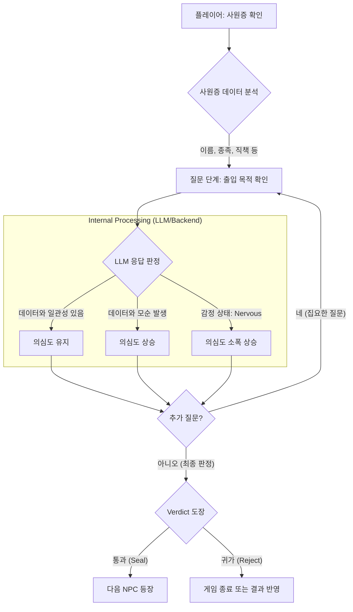

# [용사님, 들켰죠?] 심문 시스템 논리 구조 및 플로우차트 (v1.0)

## 1. 개요
본 플로우차트는 사원증 데이터(`idcarddata`)와 플레이어의 심문 과정, 그리고 LLM(Gemini)의 판정이 어떻게 연결되는지 시각화합니다.

## 2. 심문 플로우차트 (Mermaid)

## 3. 핵심 로직 설명

### **A. 일관성 검증 (Consistency Check)**
- 플레이어는 사원증의 `Detail` 항목(출입 목적, 특이 사항)을 근거로 질문합니다.
- LLM은 주입된 `idcarddata`를 기억하며 대답해야 합니다.
- **예시**: 사원증에는 '무기 점검'이라 적혀 있으나, 질문에 '가족 면회'라 답하면 즉시 모순으로 처리되어 의심도가 대폭 상승합니다.

### **B. 심리 상태 전이 (Emotional Transition)**
- 의심도가 일정 수준 이상일 때, LLM의 감정 태그는 `Nervous`나 `Exposed`로 바뀝니다.
- `Nervous`: "네... 그게... 사실은..." 식의 말더듬기나 불필요한 사족을 붙이게 설정합니다.
- `Exposed`: 정체가 탄로 나기 직전의 극심한 공포 상태.

### **C. 최종 판정 (Final Verdict)**
- 플레이어는 심문 내용을 토대로 '용사(Hero)'라고 확신하면 **귀가/체포** 도장을 찍습니다.
- 실제 데이터와 대조하여 정답 여부를 판정합니다.

---
*기록: Antigravity (PM/System Design Support)*

## 📜 Revision History
| 날짜 | 시간 | 버전 | 수정 내용 |
| :--- | :--- | :--- | :--- |
| 2026-03-18 | - | - | [보존/복구] 파일 한글화 및 폴더 구조 재편성 |